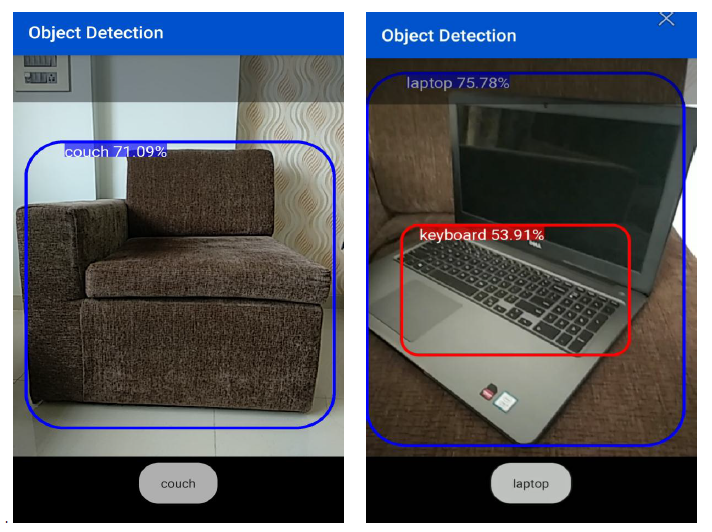
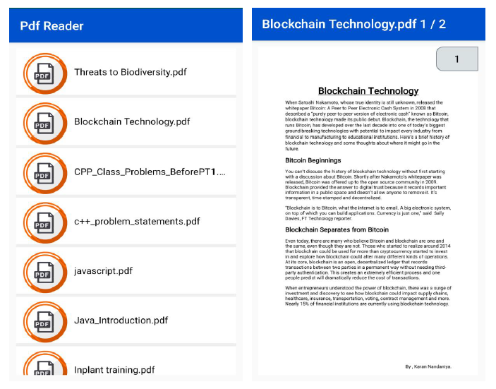

# ROSHNI

An Android app for Blind and visually impaired people.

This app contains 5 modules :

1. LIVE TEXT READER
2. COLOR DETECTON
3. OBJECT DETECTION
4. PDF READER
5. EMERGENCY SOS

* LIVE TEXT READER :

  * It is designed to detect the text from where the camera is pointed to and then reads out the detected text loudly. 
  * The text is detected using OCR(Optical Character Recognition) which gives a computer the ability to read text that appears in an image, letting applications make sense of signs, articles, flyers, pages of text, menus, or any other place that text appears as part of an image.
   
* COLOR DETECTION
 
  * It contains a predefined arraylist which contains the RGB values of the colors along with their names.
  * A pixel value is captured from the pointer and compared with the arraylist to find the closest value possible and speaks out the Detected Color.
    
* OBJECT DETECTION
  * It ontinuously detects the objects in the frames seen by your device's back camera, using a quantized MobileNet SSD model trained on the COCO dataset.
  * https://github.com/tensorflow/examples/tree/master/lite/examples/object_detection/android
  
* PDF READER
  * This module is primarily for visually impaired people.
  * It displays the list of all PDF files in your device and also contains a PDF Viewer which displays the PDF along with page numbers and zoom-in zoom-out functionality.
  * https://github.com/barteksc/AndroidPdfViewer
  
* EMERGENCY SOS
  * It helps the Blind and visually impaired people to call the Emergency Services i.e.(Police,Ambulance) directly thorogh the app.
  
## Screenshots

 * Live Text Reader
 

 * Color Detection
 
 
 * Object Detection
 

 * PDF Reader
 

 * Emergency SOS
 

# Authors

 * [Priyaank Parekh](https://github.com/priyaankparekh)
 * [Karan Nandaniya](https://github.com/karannandaniya)
